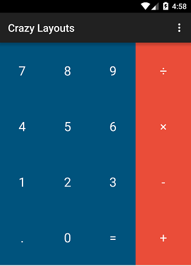

# Tarea 3

## Miércoles 24 de octubre

## Tarea (investigación)

1. AppCompatActivity y Activity
2. Investigar como arreglar los problemas que deriven de la clase R
3. Diferencia entre gridlayout y gridview
4. **¿Qué es google duplex? ¿Qué tecnologías o concepto utiliza?** Revisé el siguiente video https://www.youtube.com/watch?v=D5VN56jQMWM
5. ¿Cuál es la diferencia entre material design y materializecss?
6. ¿Qué es react native?
7. ¿Cómo hago para que mi aplicación soporte varios idiomas?
8. ¿Qué es un menú en android y describe los tres tipos de menús que tenemos?
9. ¿Cómo hago para que mi aplicación se vea bien tanto en landscape como en portrait?
10. ¿Cómo integro material design a tu aplicación?
11. ¿Qué es una Listview?
12. ¿Qué es una CardView?
13. ¿Qué es un GridView?
14. ¿Qué es un listActivity?
15. ¿Qué es un RecyclerView?
16. ¿Cuál es la diferencia entre Listview y RecyclerView? ¿Cuál es mejor? y ¿Cuándo se utiliza cada uno?

### Extras

1. ¿Qué es nodejs?
2. ¿Qué es heroku?
3. ¿Por qué windows compro github?¿Afecta a la comunidad de desarrolladores?
4. ¿En GNU/Linux, cómo creo diez archivos con la siguiente nomenclatura “tareax.md”, en donde x=1,2,3,...,10?
5. ¿Qué es speakerdeck?
6. ¿Qué hace y para que sirve git commit -ammend?
7. ¿Qué es nginx

## Tarea (código)

Subir a https://classroom.github.com/a/EOsR-I-N lo especificado en la parte de abajo.

* Crear una calculadora utilizando un *gridlayout*, se debe ver similar a la de la imagen de abajo.

* Entre el navbar y los números debe de haber un TextView que permita al usuario ver lo que esta(rá) tecleando. Por lo pronto solo será un textview estático con algún valor que ustedes elijan.

* Intente que se vea lo más estético posible utilizando estilos (me refiero al archiv style.xml, creen sus propios estilos y usenlos.)

  

Nota: En la siguiente tarea le daremos funcionalidad a dicha calculadora.

En esta  como en todas las tarea por venir deben colocar capturas de pantalla de como quedo su aplicación.

*Sección para colocar capturas de pantalla*.